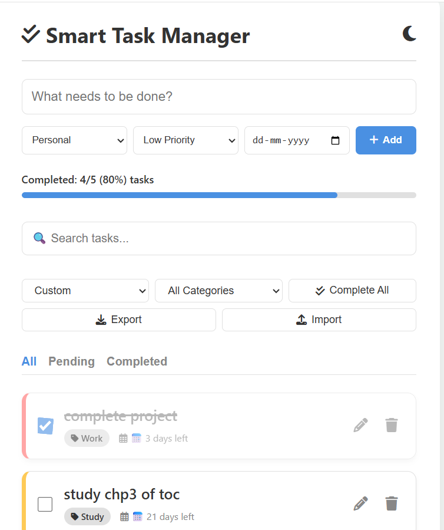
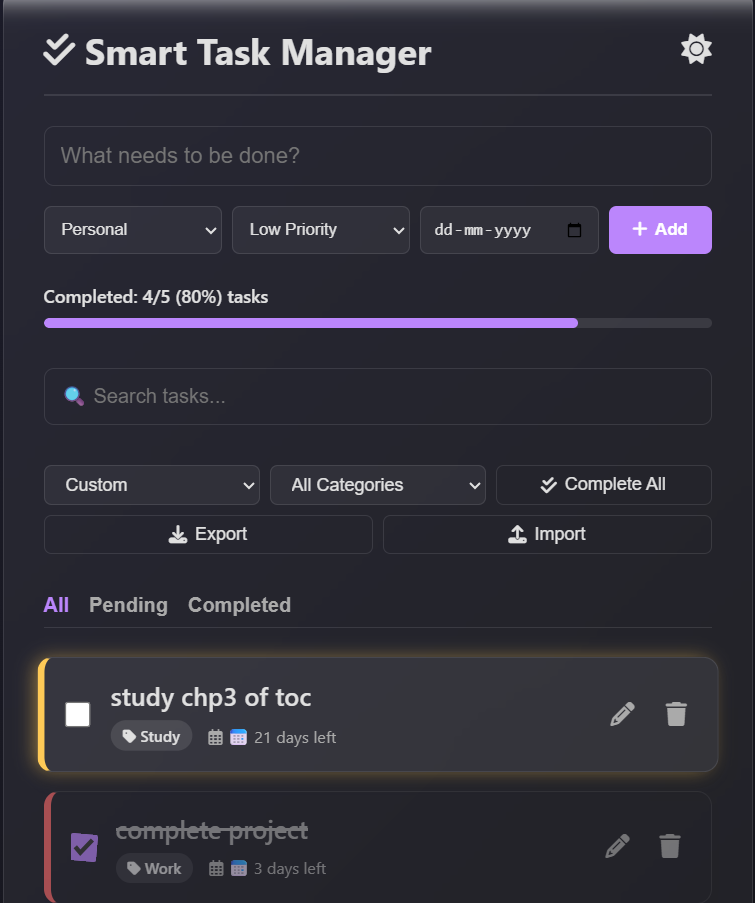

# Smart Task Manager

A simple and interactive task management web app built to help me manage daily tasks, deadlines, and priorities more efficiently.

## 🚀 Why I Built This

I often struggled to keep track of my study tasks and deadlines, so I created this project to organize everything in one place and improve my productivity.

## ✨ Features

- Add, edit, and delete tasks
- Mark tasks as completed
- Set task categories (Study, Work, Personal)
- Priority levels (Low, Medium, High)
- Deadline tracking with overdue alerts
- Drag and drop to reorder tasks
- Search and filter tasks
- Progress bar with completion percentage
- Dark mode toggle
- Sound effect on adding tasks 🔊
- Confetti animation when all tasks are completed 🎉
- Import and export tasks

## 🛠 Tech Stack

- HTML
- CSS
- JavaScript
- Local Storage (for saving tasks)

## 📸 Screenshots

## 💻 How to Run

1. Download or clone the repository
2. Open `index.html` in your browser

No installation required.

## 📌 Future Improvements

- Add user login system
- Sync tasks across devices
- Improve mobile UI further

## 👩‍💻 Author

Rachana Yadav  